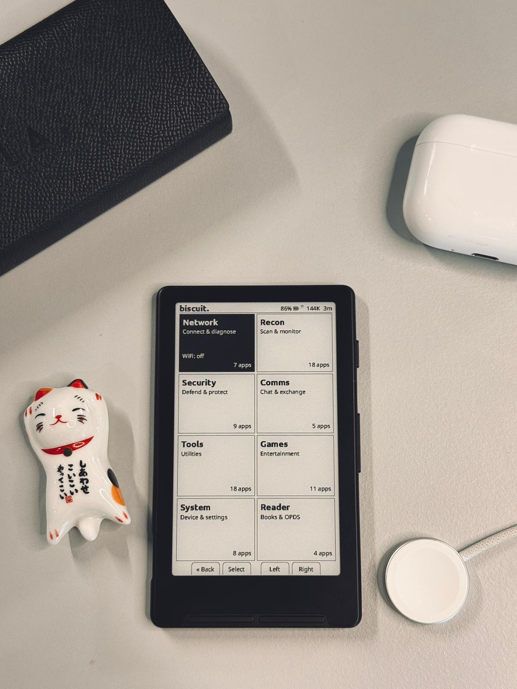
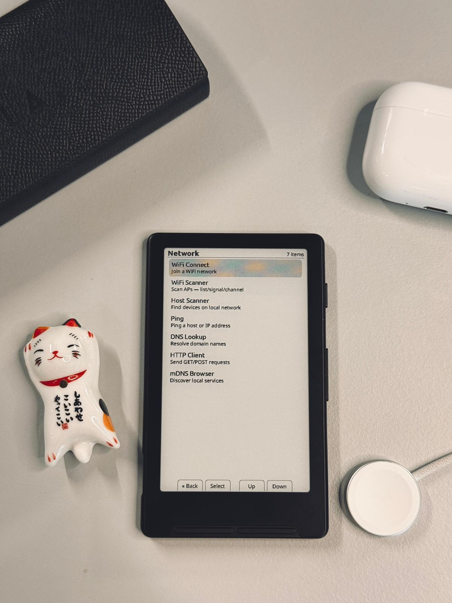
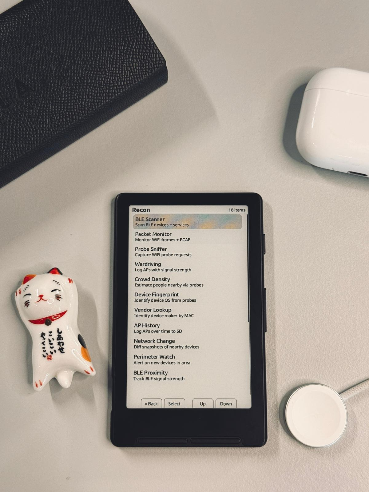
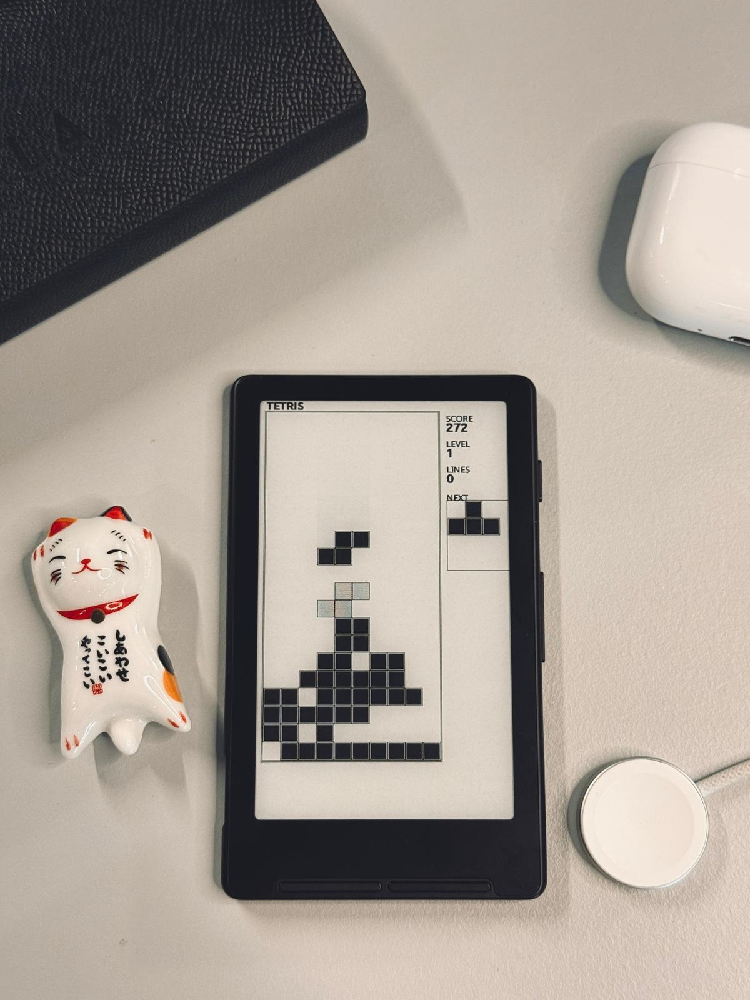

# biscuit.

Custom firmware for the **Xteink X4** e-paper device. Turns a $40 e-ink reader into a smart device with wireless tools, security features, communication, games, and utilities — while keeping full e-reader functionality.

Forked from [CrossPoint Reader](https://github.com/crosspoint-reader/crosspoint-reader). All core reading functionality comes from CrossPoint. Biscuit builds on top of it.



## What is this

Biscuit treats the Xteink X4 as a general-purpose smart device, not just an e-reader. The home screen is a tile-based dashboard with live system info (battery, heap, uptime, WiFi status). Reading is one of eight categories, not the main focus.

The 4.26" e-ink display is readable in direct sunlight, retains its image without power, and gives the device days of battery life. Seven physical buttons provide navigation without a touchscreen. WiFi and BLE 5.0 enable wireless tools. A MicroSD card stores everything.

## Hardware

| Spec | Value |
|------|-------|
| SoC | ESP32-C3 (RISC-V, 160MHz) |
| RAM | 380KB SRAM (no PSRAM) |
| Flash | 16MB |
| Display | 4.26" 800×480 e-ink, 1-bit mono |
| Input | 7 buttons (4 front, 3 side) |
| WiFi | 2.4GHz 802.11 b/g/n |
| BLE | 5.0 (shared radio with WiFi) |
| Storage | MicroSD (FAT32) |
| Port | USB-C (serial + power) |

## Apps

Biscuit ships 80+ apps across eight categories.

### Network — connect and diagnose



| App | What it does |
|-----|-------------|
| WiFi Connect | Join a WiFi network |
| WiFi Analyzer | Scan APs with list, signal strength, and channel views |
| Host Scanner | Find devices on local network |
| Ping | Ping a host or IP address |
| DNS Lookup | Resolve domain names |
| HTTP Client | Send GET/POST requests |
| mDNS Browser | Discover local network services |

### Recon — scan and monitor



| App | What it does |
|-----|-------------|
| BLE Scanner | Scan BLE devices, browse services and characteristics |
| Packet Monitor | Monitor WiFi frames with PCAP recording |
| Probe Sniffer | Capture WiFi probe requests |
| Wardriving | Log access points with signal strength |
| Crowd Density | Estimate nearby people via probe request counting |
| Device Fingerprint | Identify device OS from probe request patterns |
| Vendor Lookup | Identify device manufacturer by MAC (OUI database on SD) |
| AP History | Log visible access points over time to SD |
| Network Change | Take snapshots of nearby devices, compare for changes |
| Perimeter Watch | Alert when new devices appear in area |
| BLE Proximity | Track BLE device signal strength |
| Credential Viewer | View credentials captured by portal |
| Beacon Test | Broadcast wireless beacons |
| WiFi Test | Wireless connectivity testing |
| Captive Portal | Network portal for testing |
| BLE Beacon | BLE advertisement broadcasting |
| AirTag Test | Device location testing |
| BLE Keyboard | HID keyboard emulation (DuckyScript) |

### Security — defend and protect

| App | What it does |
|-----|-------------|
| Tracker Detector | Detect AirTags, SmartTags, and Tiles following you |
| Security Sweep | 30-second scan for cameras, trackers, rogue APs, skimmers |
| Network Monitor | Detect rogue access points and suspicious frames |
| Emergency | SOS beacon (WiFi + BLE + Mesh) with dead man's switch |
| Quick Wipe | Erase all biscuit data from SD with verification |
| PIN Security | Lock device with PIN, duress PIN for fake profile |
| RF Silence | Kill all radios and verify they are off |
| Screen Decoy | Fake screen to make device appear dead or broken |
| MAC Changer | Randomize WiFi/BLE MAC address |

### Comms — communicate and exchange

| App | What it does |
|-----|-------------|
| Mesh Chat | Text messaging via ESP-NOW, no WiFi needed, ~200m range |
| SSID Channel | Hide short messages in WiFi network names |
| Contact Exchange | Swap contact info between devices via BLE |
| Dead Drop | Temporary WiFi AP for anonymous file exchange |
| Bulletin Board | Local anonymous message board via WiFi AP |

### Tools — utilities and productivity

| App | What it does |
|-----|-------------|
| Authenticator | TOTP 2FA codes, works fully offline |
| Medical Card | Emergency medical info persistent on e-ink |
| Clock | NTP synced clock, stopwatch, pomodoro timer |
| Calculator | Basic calculator with history |
| Password Manager | Encrypted credentials stored on SD |
| QR Generator | Generate QR codes from text |
| Morse Code | Encode and decode morse |
| Unit Converter | Convert between measurement units |
| Cipher Tools | ROT13, Caesar, Vigenere, XOR, Atbash |
| OTP Generator | One-time pad random number pages |
| File Browser | Browse and view files on SD card |
| Event Logger | Timestamped notes with WiFi location tagging |
| Flashcards | Study decks loaded from CSV on SD |
| Habit Tracker | Daily habit checklist with streak tracking |
| Breadcrumb Trail | Record and retrace your path using WiFi fingerprints |
| Vehicle Finder | Find your parked car via WiFi fingerprint matching |
| Transit Alert | Get alerted when approaching a saved transit stop |
| Etch-A-Sketch | Draw on the e-ink screen, save as BMP |

### Games



Casino (slots, blackjack, roulette, coin flip, higher/lower, loot box), Minesweeper, Sudoku, Chess (with bot), Snake, Tetris, Maze, Dice Roller, Game of Life, Voronoi, Matrix Rain.

### System — device management

| App | What it does |
|-----|-------------|
| Settings | Display, reader, controls, system configuration |
| File Transfer | Upload/download files via WiFi (STA, AP, or Calibre) |
| Task Manager | View heap usage, uptime, activity stack |
| Battery | Battery level with 30-minute history graph |
| Device Info | Chip, flash, RAM, firmware, WiFi, screen info |
| Background | Radio state, SD status, active timers |
| Automation | WiFi geofence triggers and scheduled tasks |
| Reading Stats | Pages read, books completed, streaks |

### Reader

Open Book, Recent Books, Browse Files, OPDS Browser. Full EPUB 2/3 rendering, KOReader Sync, Calibre wireless transfer. All reading features are inherited from CrossPoint.

## Themes

Three UI themes, selectable in Settings:

- **Classic** — original CrossPoint style
- **Lyra** — rounded elements, modern feel (default)
- **Military** — inverted headers, sharp corners, dashed separators, uppercase labels

## SD card structure

```
/biscuit/
  portals/        # HTML templates for captive portal
  ducky/          # DuckyScript files for HID keyboard
  pcap/           # Packet captures
  scans/          # Network scan results
  logs/           # WiFi/BLE scan logs, AP history, event logs
  drawings/       # Etch-A-Sketch saved BMPs
  trails/         # Breadcrumb trail data
  snapshots/      # Network change snapshots
  flashcards/     # Flashcard decks (CSV)
  creds.csv       # Captured portal credentials
  medical.dat     # Medical card info
  totp.dat        # TOTP authenticator secrets (encrypted)
  casino.dat      # Casino credits
  habits.dat      # Habit tracker data
  security.dat    # PIN hashes
  automation.dat  # Automation rules
  oui.txt         # IEEE OUI vendor database (user-provided)
```

## Installing

### Web flasher (recommended)

1. Connect your Xteink X4 via USB-C data cable (not charge-only)
2. Wake the device by pressing Power
3. Go to https://xteink.dve.al/ and flash the firmware

To revert to stock firmware, use the same site or press "Swap boot partition" at https://xteink.dve.al/debug.

### Manual

```bash
git clone --recursive https://github.com/yattsu/biscuit
cd biscuit
pio run --target upload
```

## Development

### Prerequisites

- PlatformIO Core or VS Code + PlatformIO IDE
- Python 3.8+
- USB-C data cable
- Xteink X4

### Building

```powershell
# Windows PowerShell
$env:PYTHONUTF8=1
pio run -j 16
```

```bash
# Linux / macOS
pio run -j 16
```

### Adding translations

Translations live in `lib/I18n/translations/`. Each language is a YAML file. Add or edit strings, then regenerate:

```bash
python3 scripts/gen_i18n.py lib/I18n/translations lib/I18n/
```

See [i18n docs](./docs/i18n.md) for details.

### Debugging

```bash
python3 -m pip install pyserial colorama matplotlib
python3 scripts/debugging_monitor.py
```

The debug monitor shows color-coded logs and a real-time memory graph.

### Architecture

The firmware uses an activity-based UI architecture. Every screen is an `Activity` subclass with `onEnter()`, `loop()`, `render()`, and `onExit()`. Activities are managed by `ActivityManager` (push/pop/replace). WiFi and BLE share one radio, arbitrated by `RadioManager`.

See [architecture docs](./docs/contributing/architecture.md) for the full overview.

## Upstream

Biscuit tracks CrossPoint Reader as upstream. To sync:

```bash
git remote add upstream https://github.com/crosspoint-reader/crosspoint-reader.git
git fetch upstream
git merge upstream/master
```

## Credits

Built on [CrossPoint Reader](https://github.com/crosspoint-reader/crosspoint-reader) by the CrossPoint contributors. CrossPoint was inspired by [diy-esp32-epub-reader](https://github.com/atomic14/diy-esp32-epub-reader) by atomic14.

## License

MIT
