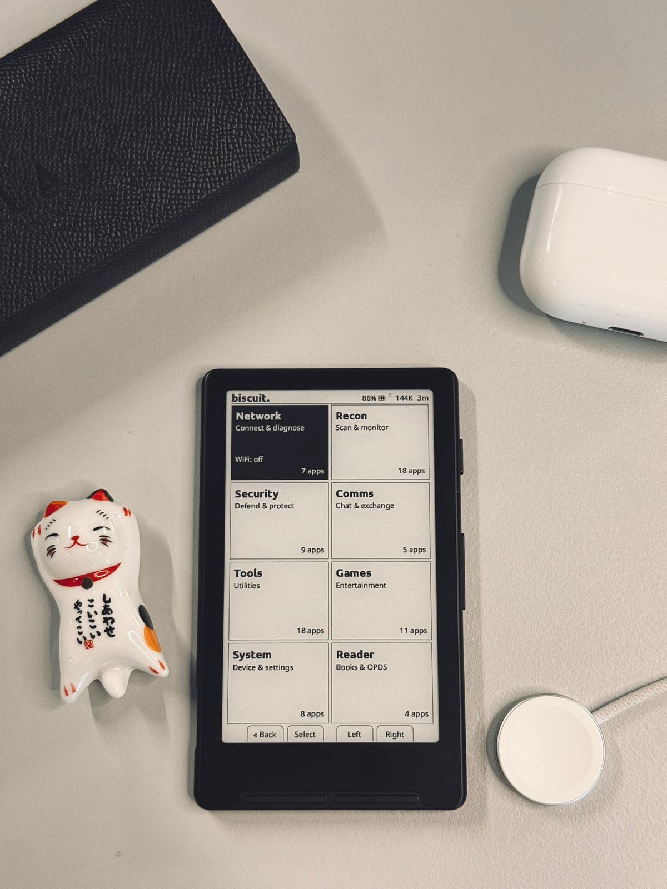
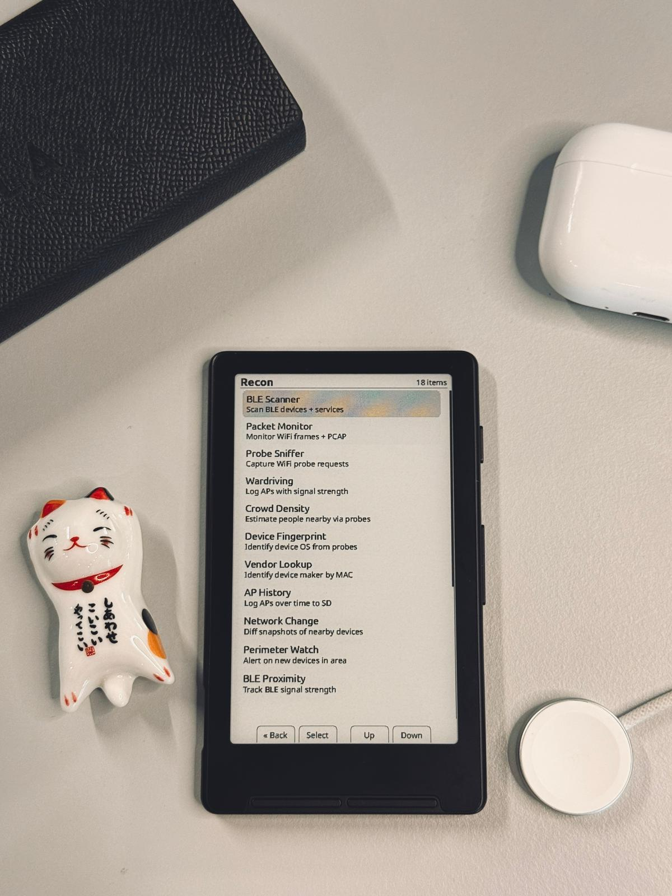
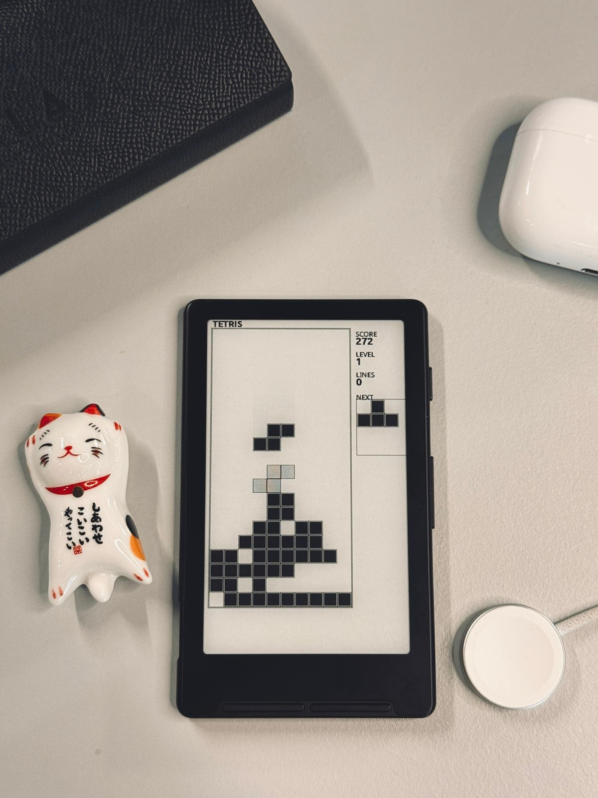

# biscuit.

Custom firmware for the **Xteink X4 and X3** e-paper devices. Turns a $40-70 e-ink reader into a smart device with wireless tools, security features, communication, games, and utilities — while keeping full e-reader functionality.

Forked from [CrossPoint Reader](https://github.com/crosspoint-reader/crosspoint-reader). All core reading functionality comes from CrossPoint. Biscuit builds on top of it.



## What is this

Biscuit treats the Xteink X4/X3 as a general-purpose smart device, not just an e-reader. The home screen is a tile-based dashboard with live system info (battery, heap, uptime, WiFi status). Reading is one of eight categories, not the main focus.

The e-ink display is readable in direct sunlight, retains its image without power, and gives the device days of battery life. Seven physical buttons provide navigation without a touchscreen. WiFi and BLE 5.0 enable wireless tools. A MicroSD card stores everything.

Reader engine: EPUB 2/3 rendering with embedded-style option, image handling, hyphenation, kerning, chapter navigation, footnotes, bookmarks, dictionary lookups ([StarDict](docs/dictionary.md)), go-to-percent, auto page turn, orientation control, focus reading, KOReader progress sync, and native handling for `.epub`, `.xtc/.xtch`, `.txt`, and `.bmp`.

## Hardware

| Spec | X4 | X3 |
|------|----|----|
| SoC | ESP32-C3 (RISC-V, 160MHz) | ESP32-C3 (RISC-V, 160MHz) |
| RAM | 380KB SRAM (no PSRAM) | 380KB SRAM (no PSRAM) |
| Flash | 16MB | 16MB |
| Display | 4.26" 800×480 e-ink, 1-bit mono | 528×792 e-ink, 1-bit mono, gyroscope-based tilt page turn |
| Input | 7 buttons (4 front, 3 side) | 7 buttons (4 front, 3 side) |
| WiFi | 2.4GHz 802.11 b/g/n | 2.4GHz 802.11 b/g/n |
| BLE | 5.0 (shared radio with WiFi) | 5.0 (shared radio with WiFi) |
| Storage | MicroSD (FAT32) | MicroSD (FAT32) |
| Port | USB-C (serial + power) | USB-C (serial + power) |
| Clock | ESP32-C3 internal RTC (drifts in deep sleep) | Dedicated DS3231 RTC (accurate across sleep) |

## Apps

The home screen is a dashboard of eight tiles. Everything lives under one of them.

| Tile | Purpose |
|------|---------|
| **Recon** | Passive scanning and monitoring — no transmission |
| **Offense** | Active wireless testing, grouped into Scan → Profile → Attack → Capture |
| **Defense** | Stealth, detection, and device hardening |
| **Comms** | Communication and exchange |
| **Tools** | Crypto, network, productivity, and creative utilities |
| **Games** | Entertainment |
| **Reader** | Ebooks, OPDS, reading stats |
| **Settings** | Preferences, file transfer, system management |

### Recon — scan and monitor (passive only)



All apps in Recon are read-only — they listen but never transmit.

| App | What it does |
|-----|-------------|
| WiFi Scanner | Discover APs and connected clients |
| BLE Scanner | Scan BLE devices, browse services and characteristics |
| Full Sweep | Combined WiFi + BLE passive scan |
| Packet Monitor | Monitor WiFi frames with PCAP recording |
| Probe Sniffer | Capture WiFi probe requests |
| Wardriving | Log access points with signal strength |
| Crowd Density | Estimate nearby people via probe request counting |
| Device Fingerprint | Identify device OS from probe request patterns |
| Vendor Lookup | Identify manufacturer by MAC (OUI database on SD) |
| AP History | Log visible access points over time to SD |
| Network Change | Snapshot nearby devices, compare for changes |
| Perimeter Watch | Alert when new devices appear in area |
| BLE Proximity | Track BLE device RSSI |
| WiFi Heat Map | RSSI mapping walkabout |
| Signal Locator | Estimate AP position via RSSI triangulation |
| Deauth Detector | Monitor for deauthentication frame spikes |

### Offense — active wireless testing

Offense opens a 2×2 sub-menu grouped into four phases. A disclaimer must be acknowledged before first use.

**Scan — target discovery**

| App | What it does |
|-----|-------------|
| WiFi Scan | Discover APs and clients |
| BLE Scan | Discover BLE devices |
| Full Sweep | Combined WiFi + BLE passive scan |
| Saved Targets | Browse cached target database |

**Profile — target analysis**

| App | What it does |
|-----|-------------|
| Target Profiler | Select and analyze a target |
| Client Enum | Devices connected to target AP |
| Host Scanner | Find devices on local network |
| Vuln Assessment | Check encryption and WPS settings |
| Signal Locator | Estimate AP position from RSSI |

**Attack — broadcast and testing tools**

| App | What it does |
|-----|-------------|
| Beacon Test | Custom beacon broadcasting |
| WiFi Test | Wireless connectivity testing |
| Captive Portal | Network portal for testing |
| Beacon Flood | Broadcast 30 random SSIDs |
| SSID Clone | Clone a WiFi AP (open, same channel) |
| BLE Spam | Proximity / Fast Pair / Swift Pair flood |
| BLE Keyboard | HID keyboard emulation (DuckyScript over BLE) |
| AirTag Test | Device location testing |
| USB Keyboard | Wired DuckyScript over USB-C |

**Capture — review and export**

| App | What it does |
|-----|-------------|
| Captured Data | Handshakes, credentials, PCAPs, BLE logs |
| Credential Viewer | View credentials captured by portal |
| Probe Log | Recorded WiFi probe requests |
| Scan History | Browse previously found targets |
| Wipe Captures | Delete all captured data |

### Defense — stealth and protect

Ghost Mode is the headline entry — it rotates MAC, kills radios, and cleans up state in one action (replacing the old standalone MAC Changer and RF Silence apps).

| App | What it does |
|-----|-------------|
| Ghost Mode | MAC rotate + RF kill + state cleanup, one shot |
| Tracker Detector | Detect AirTags, SmartTags, and Tiles following you |
| Security Sweep | Scan for cameras, trackers, rogue APs, skimmers |
| Network Monitor | Detect rogue APs and suspicious frames |
| Emergency SOS | SOS beacon (WiFi + BLE + Mesh) with dead man's switch |
| Phone Tether | BLE proximity disconnect alert |
| Quick Wipe | Erase all biscuit data from SD with verification |
| PIN Security | Lock device with PIN, duress PIN for fake profile |
| Screen Decoy | Fake screen to hide activity |
| SD Encryption | Encrypt biscuit data on SD with PIN |

### Comms — communicate and exchange

| App | What it does |
|-----|-------------|
| Mesh Chat | ESP-NOW text chat, no WiFi needed, ~200m range, multi-hop relay |
| SSID Channel | Hide short messages in WiFi network names |
| Contact Exchange | Swap contact cards between devices via BLE |
| Dead Drop | Temporary WiFi AP for anonymous file exchange |
| Bulletin Board | Local anonymous message board via WiFi AP |

### Tools — utilities and productivity

A single tile that merges the old Network section with crypto, productivity, tracking, and creative apps.

**Security & crypto**

| App | What it does |
|-----|-------------|
| Authenticator | TOTP 2FA codes, fully offline |
| TOTP QR | Show a 2FA code as a scannable QR |
| Password Manager | Encrypted credentials stored on SD |
| Medical Card | Emergency medical info persistent on e-ink |
| Stego Notes | Hide text inside BMP images |

**Network**

| App | What it does |
|-----|-------------|
| WiFi Connect | Join a WiFi network |
| WiFi Scanner | APs, signal, channels |
| Host Scanner | Find devices on local network |
| Ping | Ping a host or IP address |
| DNS Lookup | Resolve domain names |
| HTTP Client | Send GET/POST requests |
| mDNS Browser | Discover local services |

**Productivity**

| App | What it does |
|-----|-------------|
| Clock | NTP clock, stopwatch, pomodoro timer |
| Calculator | Basic calculator |
| QR Generator | Generate QR codes from text |
| Morse Code | Encode and decode morse |
| Unit Converter | Convert between measurement units |
| Cipher Tools | ROT13, Caesar, Vigenere, XOR |
| OTP Generator | One-time pad random number pages |

**Tracking & logging**

| App | What it does |
|-----|-------------|
| Event Logger | Timestamped notes with WiFi location tagging |
| Flashcards | Study decks loaded from CSV on SD |
| Habit Tracker | Daily habit checklist with streak tracking |
| Breadcrumb Trail | Record and retrace your path using WiFi fingerprints |
| Vehicle Finder | Find your parked car via WiFi fingerprint matching |
| Transit Alert | Alert when approaching a saved transit stop |

**Creative**

| App | What it does |
|-----|-------------|
| Etch-A-Sketch | Draw on the e-ink screen, save as BMP |
| Barcode Generator | Code 128 / Code 39 / EAN-13 |
| Key Copier | Draw key profiles from bitting codes |
| WiFi QR Share | Share WiFi credentials as a QR code |
| File Browser | Browse and view files on SD card |
| Countdown | Big countdown timer |

### Games



Casino (slots, blackjack, roulette, coin flip, higher/lower, loot box), Minesweeper, Sudoku, Chess (with bot), Snake, Tetris, Maze, Dice Roller, Game of Life, Voronoi, Matrix Rain.

### Reader

| App | What it does |
|-----|-------------|
| Open Book | Browse and open an ebook |
| Recent Books | Continue where you left off |
| OPDS Browser | Download books from OPDS servers |
| Reading Stats | Pages read, books completed, streaks |
| Browse Files | File manager for the SD card |

Full EPUB 2/3 rendering, KOReader Sync, and Calibre wireless transfer are inherited from CrossPoint.

### Settings — system and configuration

Promoted to a top-level tile from the old System section.

| App | What it does |
|-----|-------------|
| Settings | Display, reader, controls, system configuration |
| WiFi Transfer | Upload/download files via WiFi (STA, AP, or Calibre) |
| USB Storage | Share the SD card as a USB mass-storage drive |
| Task Manager | View heap, uptime, and activity stack |
| Battery | Battery level with history graph |
| Device Info | Chip, flash, RAM, firmware, WiFi, screen info |
| Background | Radio state, SD status, active timers |
| Automation | WiFi geofence triggers and scheduled tasks |

## Themes

Three UI themes, selectable in Settings:

- **Classic** — original CrossPoint style
- **Lyra** — rounded elements, modern feel (default)
- **Military** — inverted headers, sharp corners, dashed separators, uppercase labels

## SD card structure

```
/biscuit/
  portals/        # HTML templates for captive portal
  ducky/          # DuckyScript files for HID keyboard
  pcap/           # Packet captures
  scans/          # Network scan results
  logs/           # WiFi/BLE scan logs, AP history, event logs
  drawings/       # Etch-A-Sketch saved BMPs
  trails/         # Breadcrumb trail data
  snapshots/      # Network change snapshots
  flashcards/     # Flashcard decks (CSV)
  creds.csv       # Captured portal credentials
  medical.dat     # Medical card info
  totp.dat        # TOTP authenticator secrets (encrypted)
  casino.dat      # Casino credits
  habits.dat      # Habit tracker data
  security.dat    # PIN hashes
  automation.dat  # Automation rules
  oui.txt         # IEEE OUI vendor database (user-provided)
```

## Wireless workflows

- File transfer web UI
- EPUB Optimizer
- Web settings UI/API (edit many device settings from browser)
- WebSocket fast uploads
- WebDAV handler
- AP mode (hotspot) and STA mode (join existing Wi-Fi), both with QR helpers
- Calibre wireless connect flow
- OPDS browser with saved servers (up to 8), search, pagination, and direct download
- OTA update checks and installs from GitHub releases

## Customization

- **Themes**: Classic, Lyra, Lyra Extended, Military, Noir, Radar, RoundedRaff.
- Sleep screen modes, front/side button remapping, status bar controls, power-button behavior, refresh cadence, and more.
- **Localization**: 24 UI languages and counting. RTL support.

### Coming soon

- More themes.
- Much more! stay tuned.

---

## USB-locked devices (Xteink Unlocker)

Some Xteink units purchased from third-party stores (e.g. AliExpress) ship with USB flashing locked from the factory.
If your device is locked, you will need to use the **Xteink Unlocker** tool available at
https://crosspointreader.com/#unlock-tool before you can flash CrossPoint.

**You do not need this tool if you bought your device directly from xteink.com.** Those units are not locked.

**Not sure if your device is locked?** Power it on, connect the USB-C cable, and try flashing via the web flasher first (see
[Install firmware](#install-firmware) below). If the browser's serial device picker does not show your device, try a different
USB port or browser before assuming the device is locked. Only reach for the unlocker if the device still doesn't appear.

> ### ⚠️ WARNING: READ THIS BEFORE USING THE UNLOCKER ⚠️
>
> **The only officially supported firmwares in the unlock tool are CrossPoint and CrossInk.** Biscuit is a third-party fork and is not listed there.
>
> Flashing any unsupported firmware on a USB-locked device may **permanently brick the device** or leave it **permanently
> stuck on that firmware with no recovery path**. Once USB flashing is re-locked, your only way back is via OTA, and if
> the firmware you flashed doesn't support OTA, **there is no way out**.
>
> **Biscuit supports OTA updates** (see below), so a USB-locked device flashed with Biscuit can still be recovered/updated without re-unlocking. Confirm this still holds for the build you flash before relying on it.

## Install firmware

### Web flasher (recommended)

1. Connect your Xteink X4/X3 via USB-C data cable (not charge-only)
2. Wake the device by pressing Power
3. Go to https://xteink.dve.al/ and flash the firmware

To revert to stock firmware, use the same site or press "Swap boot partition" at https://xteink.dve.al/debug.

### Command line

1. Install [`esptool`](https://github.com/espressif/esptool):

```bash
pip install esptool
```

2. Build or download `firmware.bin` (see [Development quick start](#development-quick-start) below).
3. Connect your device via USB-C.
4. Find the device port. On Linux, run `dmesg` after connecting. On macOS:

```bash
log stream --predicate 'subsystem == "com.apple.iokit"' --info
```

5. Flash:

```bash
esptool.py --chip esp32c3 --port /dev/ttyACM0 --baud 921600 write_flash 0x10000 /path/to/firmware.bin
```

Adjust `/dev/ttyACM0` to match your system.

### Manual

```bash
git clone --recursive https://github.com/yattsu/biscuit
cd biscuit
pio run --target upload
```

---

## Custom SD-card fonts

Convert your own TTF/OTF files into `.cpfont` files that load from the SD card. No firmware reflash is needed.

1. Go to https://crosspointreader.com/fonts and open the "SD-card font builder" form.
2. Upload up to four styles (regular, bold, italic, bold-italic), set the family name, point sizes, and Unicode range.
3. Download the generated `.cpfont` files.
4. Copy them to your SD card under `/fonts/YourFont/` (or `/.fonts/YourFont/` to hide the folder).
5. Select the font on the device from the font settings.

Conversion runs the firmware repo's `lib/EpdFont/scripts/fontconvert_sdcard.py` script unmodified, so output matches a local host build.

---

## Documentation

- [User Guide](./USER_GUIDE.md)
- [Web server usage](./docs/webserver.md)
- [Web server endpoints](./docs/webserver-endpoints.md)
- [Project scope](./SCOPE.md)
- [Contributing docs](./docs/contributing/README.md)
- [Touch and UI development](./docs/contributing/touch-and-ui.md) - FreeInkUI components for new screens, the touch bridge for existing ones, and build envs for the non-Xteink touch devices

---

## Development quick start

### Prerequisites

- [pioarduino](https://github.com/pioarduino/pioarduino) or VS Code + pioarduino plugin
- Python 3.8+
- `clang-format` 21
- USB-C cable supporting data transfer

### Setup

```bash
git clone --recursive https://github.com/yattsu/biscuit
cd biscuit

# if cloned without --recursive:
git submodule update --init --recursive
```

### Nix/NixOS

Nix/NixOS users can enter the development shell with either `nix develop` (flakes) or `nix-shell`:

```bash
nix develop -f nix
# or
nix-shell nix
```

To flash a connected ESP32-C3 device, enable PlatformIO's udev rules in your NixOS configuration:

```nix
services.udev.packages = with pkgs; [ platformio-core.udev ];
```

After rebuilding the system configuration, reconnect the device or reload udev rules.

### Build / flash / monitor

```powershell
# Windows PowerShell
$env:PYTHONUTF8=1
pio run --target upload
```

```bash
# Linux / macOS
pio run --target upload
```

### Contributor pre-PR checks

```bash
./bin/clang-format-fix
pio check -e default
pio run -e default
```

### Adding translations

Translations live in `lib/I18n/translations/`. Each language is a YAML file. Add or edit strings, then regenerate:

```bash
python3 scripts/gen_i18n.py lib/I18n/translations lib/I18n/
```

See [i18n docs](./docs/i18n.md) for details.

### Debugging

```bash
python3 -m pip install pyserial colorama matplotlib
```

After that run the script:

```sh
# For Linux
# This was tested on Debian and should work on most Linux systems.
python3 scripts/debugging_monitor.py

# For macOS
python3 scripts/debugging_monitor.py /dev/cu.usbmodem2101
```

Minor adjustments may be required for Windows.

---

## Internals

CrossPoint Reader is pretty aggressive about caching data down to the SD card to minimise RAM usage. The ESP32-C3 only has ~380KB of usable RAM, so we have to be careful. A lot of the decisions made in the design of the firmware were based on this constraint.

### Data caching

The first time chapters of a book are loaded, they are cached to the SD card. Subsequent loads are served from the
cache. This cache directory exists at `.crosspoint` on the SD card. The structure is as follows:

```text
.crosspoint/
├── epub_<hash>/         # one directory per book, named by content hash
│   ├── progress.bin     # reading position (chapter, page, etc.)
│   ├── cover.bmp        # generated cover image
│   ├── book.bin         # metadata: title, author, spine, TOC
│   ├── css_rules.cache  # parsed CSS rule cache
│   ├── img_*            # rendered image cache files
│   └── sections/        # per-chapter layout cache
│       ├── 0.bin
│       ├── 1.bin
│       └── ...
├── settings.json        # device settings
├── state.json           # resume/runtime state
└── recent.json          # recent books list
```

Removing `/.crosspoint` clears all cached metadata and forces a full regeneration on next open. Book deletes, overwrites, and moves done through the firmware or web UI clear or re-key matching caches; manual SD-card edits may leave stale cache directories behind.

For more details on the internal file structures, see the [file formats document](./docs/file-formats.md).

### Architecture

The firmware uses an activity-based UI architecture. Every screen is an `Activity` subclass with `onEnter()`, `loop()`, `render()`, and `onExit()`. Activities are managed by `ActivityManager` (push/pop/replace). WiFi and BLE share one radio, arbitrated by `RadioManager`.

See [architecture docs](./docs/contributing/architecture.md) for the full overview.

## Upstream

Biscuit tracks CrossPoint Reader as upstream. To sync:

```bash
git remote add upstream https://github.com/crosspoint-reader/crosspoint-reader.git
git fetch upstream
git merge upstream/master
```

## Credits

Built on [CrossPoint Reader](https://github.com/crosspoint-reader/crosspoint-reader) by the CrossPoint contributors. CrossPoint was inspired by [diy-esp32-epub-reader](https://github.com/atomic14/diy-esp32-epub-reader) by atomic14.

## License

MIT

---

## Contributing

Contributions are welcome. If you're new to the codebase, start with the [contributing docs](./docs/contributing/README.md). For things to work on, check the [ideas discussion board](https://github.com/crosspoint-reader/crosspoint-reader/discussions/categories/ideas) — leave a comment before starting so we don't duplicate effort.

Everyone here is a volunteer, so please be respectful and patient. For governance and community expectations, see [GOVERNANCE.md](./GOVERNANCE.md).

---

## Community forks

One of the best things about open source is that anyone can take the code in a different direction. Biscuit itself is one such fork — if you need something outside Biscuit's or CrossPoint's [scope](./SCOPE.md), check out the community forks:

- [CrossInk](https://github.com/uxjulia/CrossInk) — Typography and reading tracking: Bionic Reading (bolds word stems to create fixation points), guide dots between words, improved paragraph indents, and replaces the default fonts with ChareInk/Lexend/Bitter.

- [papyrix-reader](https://github.com/bigbag/papyrix-reader) — Adds FB2 and MD format support. Actively maintained with Arabic script support. Custom themes via SD card.

- ~~[crosspet](https://github.com/trilwu/crosspet) — A Vietnamese fork that adds a Tamagotchi-style virtual chicken that grows based on your reading milestones (pages read, streaks, care). Also: Flashcards, Weather, Pomodoro timer, and mini-games.~~ (Unmaintained)

- [crosspoint-reader-cjk](https://github.com/aBER0724/crosspoint-reader-cjk) — Purpose-built for Chinese, Japanese, and Korean reading.

- [inx](https://github.com/obijuankenobiii/inx) — Completely reimagines the user interface with tabbed navigation.

- ~~[PlusPoint](https://github.com/ngxson/pluspoint-reader) — custom JS apps support.~~ (Unmaintained)

- [crosspoint-reader-papers3](https://github.com/juicecultus/crosspoint-reader-papers3) — Crosspoint port for M5Stack Paper S3.

- [t5s3-reader](https://github.com/ShallowGreen123/t5s3-reader) — Crosspoint port for LilyGo T5 ePaper S3 / T5S3 4.7-inch e-paper device.

**Note:** Many CrossPoint fork features will make their way into Biscuit over time as we sync upstream.

Want to build your own device? Be sure to check out the [de-link](https://github.com/iandchasse/de-link) project.

---

Biscuit is **not affiliated with Xteink, CrossPoint Reader, or any device manufacturer**.

Huge shoutout to [diy-esp32-epub-reader](https://github.com/atomic14/diy-esp32-epub-reader), which inspired this project.
