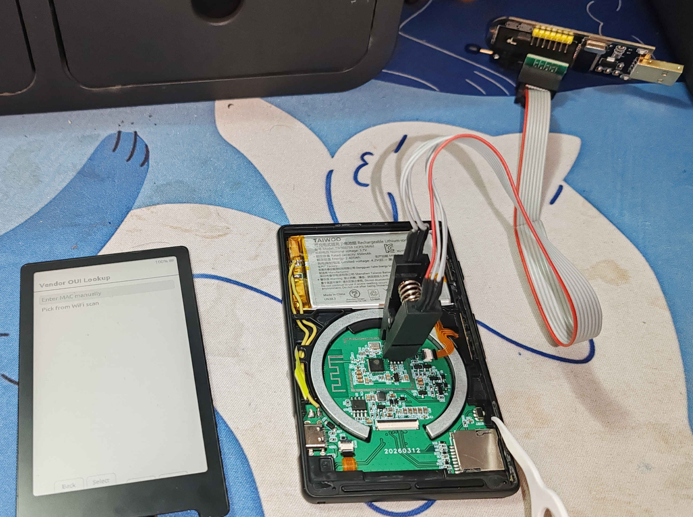
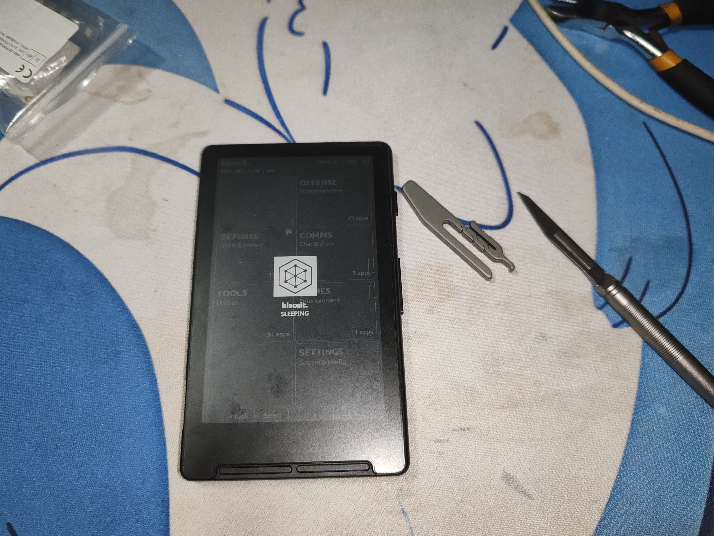
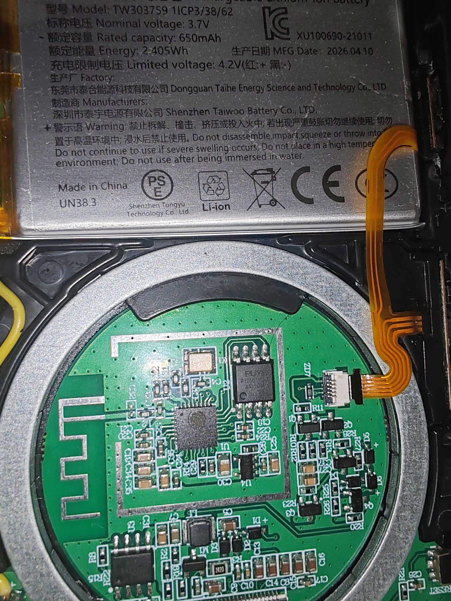
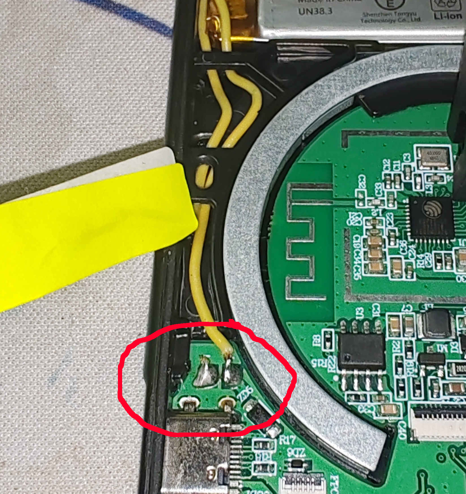
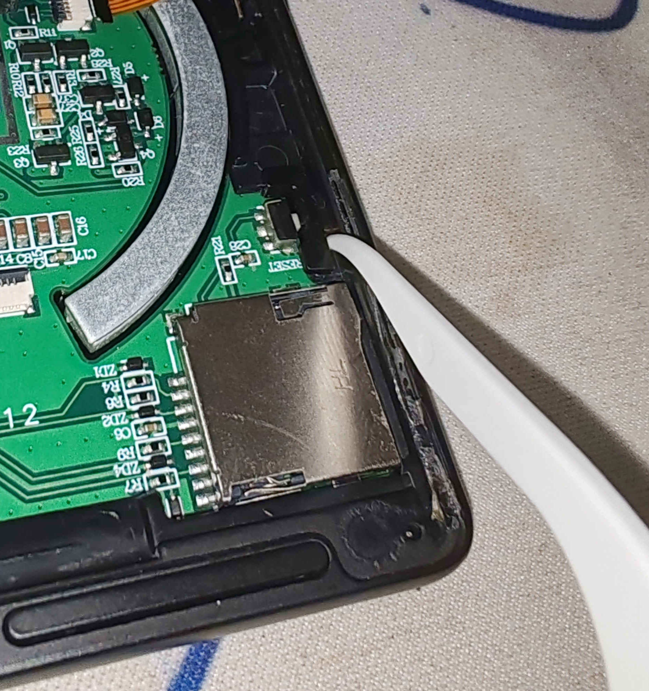
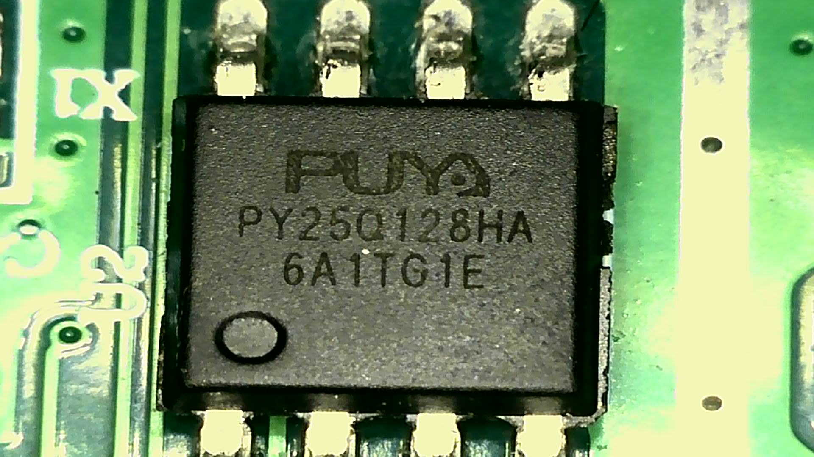
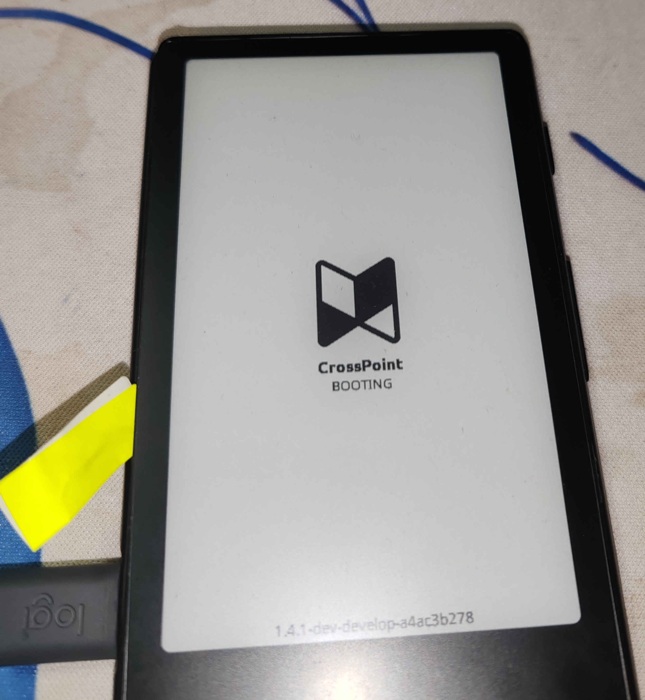
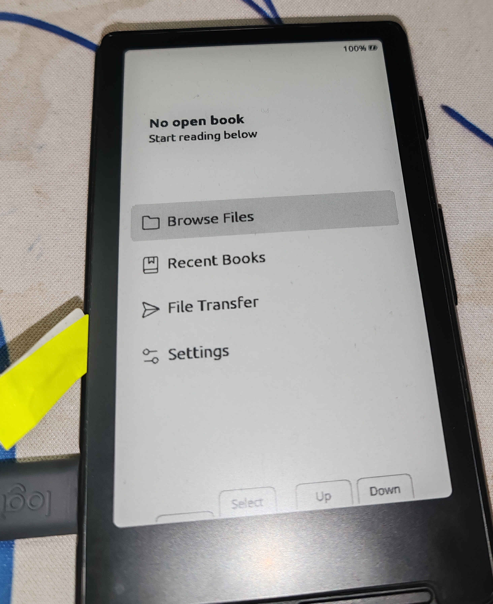

# Recovering a Bricked Xteink



This guide covers installing CrossPoint on an Xteink that's bricked, or stuck on firmware with no path to flash a replacement. It works by writing firmware directly to the SPI flash chip with an external programmer, bypassing the ESP32-C3 entirely.

If your device isn't USB-locked, flash it over USB instead — it's safer and much less invasive. What follows should only be a last resort.

*Example: a device stuck on Biscuit firmware, unresponsive to a normal USB flash.*



## Required Tools

- Acetone or another nail polish remover.
- A SPI flash programmer. On this guide we use a CH341a; A Bus Pirate, Raspberry Pi/Pico or suitable Arduino, also works.
- Programmer software. flashrom (with libftdi) work on all OSs.
- esptool.py, but only if you intend to dump firmware from another device to use as your source image.
  
## Before You Start

- Lithium batteries are dangerous, do not short or puncture. Be careful.
- The display is fragile, don't bend or flex it. do not force the ZIF connector.
- There is no undo here. A mis-wired clip or a short circuit can turn a bricked device into a dead one. Proceed at your own risk.


## Procedure

### 1. Obtain a Firmware Image

Two options:

- Use the backup provided by @Uri-Tauber at `crosspoint-reader/docs/images/spiflash/crosspoint_spiflash_backup.tar.xz`, and extract the `.bin` file.
- Dump one yourself from a working, unlocked device over USB:
    - Turn the device on, connect the USB cable and do:
    ```bash
    ~$ pio pkg exec -p tool-esptoolpy -- esptool.py --chip esp32c3 -p /dev/ttyACM0 -b 921600 read_flash 0x000000     0x1000000 crosspoint_backup.bin
     # or
    ~$ esptool.py --chip esp32c3 -p /dev/ttyACM0 -b 921600 read_flash 0x000000 0x1000000 crosspoint_backup.bin
    ```

### 2. Disconnect Power Sources and Accessories

- Remove and set the SD card aside for reinsertion later.
- Remove any USB cable.
- Confirm nothing else is supplying power to the board.

### 3. Remove the Screen

Ordinary nail polish remover softens the adhesive under the screen's edges — it takes some patience, and there's no clean way around that.

- In a well ventilated space, free of any ignition source, apply acetone or nail polish remover to the borders of the screen.
- Check it from time to time, make sure the borders of the screen stay wet for around 2 hours.
- Start to pry open from a lower corner, and move around.
- If necessary, use a non-conductive tool to help you.
- Flip open the ZIF connector to release the screen from the board.




### 4. Disconnect the Battery

Cut a single battery wire close to the board, then cover the cut end with tape to prevent shorting.



### 5. Hold the Reset Button Down

Keeping reset held prevents the ESP32-C3 from interfering with SPI communication during the read/write. A piece of pointed plastic works well as a holder.



### 6. Attach the Test Clip

Connect the test clip to the flash chip before connecting the programmer to USB. Notes:

- The clip's red wire aligns with pin 1, marked with a dot on both the chip and the board silkscreen.
- Confirm each lead is making contact with a chip pin and not the epoxy body.
- If the programmer has a voltage selector, set it to 3.3V.
- Verify no other power source is connected — use a multimeter if there's any doubt.
  



### 7. Connect the Programmer to the PC


### 8. Verify the Connection by Reading Twice

Read the chip twice and compare hashes. If they don't match, something in the clip connection is off — fix that before writing anything to the chip.

```bash
~$ sudo flashrom --programmer ch341a_spi -r backup_0.bin
    [...]
    Reading flash... done.
~$ sudo flashrom --programmer ch341a_spi -r backup_1.bin
    [...]
    Reading flash... done.
    # lets compare the hashes from the back ups
~$ md5sum backup_0.bin
    211522e56616ea46ac9bcf82d3451eb2  backup_0.bin
~$ md5sum backup_1.bin
    211522e56616ea46ac9bcf82d3451eb2  backup_1.bin
```

### 9. Flash the Chip

```bash
~$ sudo flashrom --programmer ch341a_spi -w crosspoint_backup.bin
    [...]
    Reading old flash chip contents... done.
    Erasing and writing flash chip... Erase/write done.
    Verifying flash... VERIFIED.
```

### 10. Power and Test The Device

- Disconnect the programmer from the USB port.
- Remove the test clip.
- Release the reset button.
- Reinsert the SD card.
- Reconnect the screen.
- Power the device via USB cable, no need to solder the battery yet.
- Press the power button for a couple seconds.




If CrossPoint boots successfully, the device can be fully reassembled.

